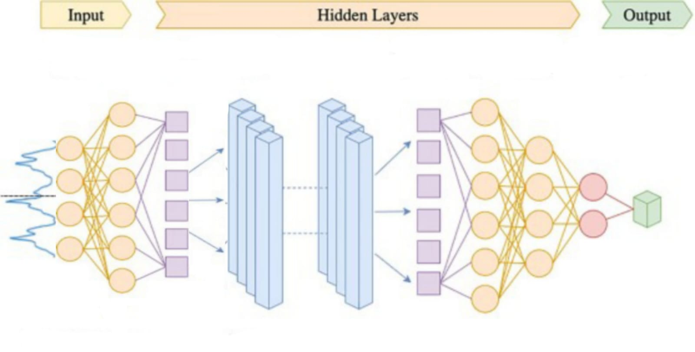

# Optimizing Seismic Detection for Planetary Missions Across the Solar System

The exploration of seismic activity on distant planets holds the potential to reveal crucial information about their internal structures. However, detecting true seismic quakes amidst noise from environmental interference and spacecraft disturbances presents a significant challenge. We, team **ONURONON**, are addressing this problem as part of the **“Seismic Detection Across the Solar System”** challenge for NASA Space Apps Challenge 2024. Our mission is to enhance the accuracy and efficiency of seismic data transfer from celestial bodies like the Moon and Mars, while reducing energy consumption.

## Problem Statement

Planetary seismology missions struggle with the power requirements necessary to send continuous seismic data back to Earth. But only a fraction of this data is scientifically useful! Instead of sending back all the data collected, what if we could program a lander to distinguish signals from noise, and send back only the data we care about? Our challenge is to write a computer program to analyze real data from the Apollo missions and the Mars InSight Lander to identify seismic quakes within the noise!

## Objectives

- **Develop an algorithm** to analyze seismic data from the Apollo missions and Mars InSight Lander.
- **Filter noise and detect genuine seismic events** within the dataset.
- **Optimize energy usage** by transmitting only relevant seismic data.
- **Use machine learning techniques or conventional algorithms (e.g., STA/LTA)** to enhance detection accuracy.

## Solution Procedures

**We have developed a machine learning model** to solve the challenge. The steps are described below:-  
<a href="https://www.kaggle.com/code/nasiathasanfahim/2n-2c-4n-fold2/notebook">Kaggle Notebook 1</a>  
<a href="https://www.kaggle.com/code/nasiatfahim/2n-1c-4n-fold2/notebook">Kaggle Notebook 2</a>  
<a href="https://www.kaggle.com/code/kagglehood/3c-6n-fold3/notebook">Kaggle Notebook 3</a>  

### Signal Processing:
Signal processing is crucial in handling seismic data to clean it up and prepare it for analysis. In our project, the raw seismic data collected from the Apollo missions, Mars InSight, and Earth (via IRIS) was subjected to preprocessing steps like noise filtering, normalization, and unit conversion. Band-pass filters were applied to isolate the seismic signals relevant to P-wave detection. By reducing environmental interference and instrument noise, we ensured the dataset was cleaner and more representative of true seismic events. This allowed us to better distinguish between actual seismic activity and irrelevant noise in the data.

### Feature Extraction:
Feature extraction focuses on identifying significant patterns in seismic data that can help detect the arrival of P-waves. In our model, we used key features like changes in velocity and frequency peaks to signal the potential arrival of a P-wave. Time and velocity were analyzed to determine anomalies that represent the onset of seismic events. We utilized lag to predict the arrival time, extracting temporal and frequency-based features from the seismic signals. These features were crucial for improving the accuracy of the machine learning model, allowing it to learn the nuances of P-wave arrivals.

### Classification:
The classification task in our project was focused on distinguishing between noise and actual seismic quakes. Using our annotated dataset, where we manually labeled the P-wave arrival times, the model was trained to classify different segments of seismic data. The key objective was to ensure the model could correctly identify seismic quakes while ignoring false positives caused by environmental noise or spacecraft-induced vibrations. We experimented with different machine learning models, and finally settled on a custom-built neural network that could effectively differentiate between noise and seismic events with a high degree of accuracy.

### Data Reduction:
To address the limited energy resources of space missions, our project emphasized data reduction. Instead of continuously transmitting large volumes of raw seismic data back to Earth, we designed our system to filter and send only relevant seismic data, specifically focusing on detected P-wave events. By using machine learning to analyze seismic data locally on the lander, we can minimize the need for redundant data transmission, which reduces power consumption. This data reduction approach makes our solution energy-efficient and more suitable for long-duration space missions where bandwidth and power are limited.

### Model Description:
Our model was developed from scratch using PyTorch and trained with only 30% of the 23,000 seismic datasets we collected from IRIS due to resource constraints. The architecture includes two Conv1D layers for processing time-series data and four linear neuron layers for classification and prediction. We utilized Mean Squared Error (MSE) as the loss function and ADAM as the optimizer to enhance learning efficiency. The model was designed to predict the P-wave arrival time using lag-based prediction, allowing us to train it to identify key seismic events while minimizing noise interference. Despite limited resources, the model showed promising accuracy in identifying P-waves.

### Model Architecture: 
   After testing statistical models and pre-trained neural networks, we designed a custom neural network using PyTorch. The final architecture consists of:
   - 2 Linear Layers
   - 2 Conv1D Layers for processing the time-series data
   - 4 Fully Connected Layers (Linear Neurons)
   - Loss Function: Mean Squared Error (MSE)
   - Optimizer: ADAM

   This model was trained to detect P-wave arrivals by identifying patterns in seismic velocity data. It was optimized for accuracy while maintaining low computational requirements to ensure energy efficiency in space.

## Key Benefits

The primary benefits that one can achieve from our **Machine Learning Model** are:-

- Reduces Power Consumption
- Improves Data Accuracy
- Predict Seismic Activity
- Crucial for Building Safe Habitats on the Moon and Mars
  
## Resources
<!-- - **Earth Data from pyweed (train-dataset):** https://www.kaggle.com/datasets/nasiatfahim/earthquake-time-vs-velocity-dataset
- **NASA Provided Dataset (test-dataset):** https://www.kaggle.com/datasets/nasiatfahim/space-app-2024-official-dataset -->

- **Train Dataset:** <a href="https://www.kaggle.com/datasets/nasiatfahim/earthquake-time-vs-velocity-dataset">Earth Data from IRIS</a>
- **Test Dataset:** <a href="https://www.kaggle.com/datasets/nasiatfahim/space-app-2024-official-dataset">NASA Provided Moon and Mars Dataset</a>

## Usage
**The Jupyter Notebook contains detailed instructions on how to run the seismic analysis and visualize the data.** The provided algorithms can be modified to enhance the detection of seismic quakes or use machine learning models for more complex analysis.

## Future Work
**We plan to:**
- Further optimize the energy efficiency of the algorithm for real-time onboard use in future space missions.
- Explore additional machine learning techniques to improve detection in low signal-to-noise ratio environments.
- Implement adaptive learning capabilities that allow the system to improve its detection accuracy based on mission-specific data patterns over time.
- Collaborate with planetary scientists to refine the seismic event classification, ensuring the most scientifically valuable data is prioritized.

## Conclusion
In conclusion, Project **CoSeismic** by Team 'Onuronon' is an innovative approach to tackling the challenges of planetary seismology. By developing a simulation that enhances seismic data analysis while conserving energy, we aim to push the boundaries of space exploration. Our app-based solution not only addresses the limitations of real-time data collection but also makes the process more accessible and efficient. As we continue refining this technology, we look forward to contributing to safer and more successful space missions, paving the way for human life on other planets.

## About us
**For any further information, please contact:**

### Team Onuronon
**Team link at NASA Space App's Website:**
<a href="https://www.spaceappschallenge.org/nasa-space-apps-2024/find-a-team/onuronon/">Onuronon</a>  
Shahjalal University of Science and Technology, Bangladesh    

### Team Members:

- **Name**: Rayhanul Amin Tanvir 
**NASA Space App Username**: rayhanul_amin 
**Email**: rayhanulamint2@gmail.com 
<!-- **Phone**: +8801866843730  -->
Dept. of CSE, SUST  

- **Name**: Nasiat Hasan Fahim 
**NASA Space App Username**: nasiat 
**Email**: nhfahim18@gmail.com 
<!-- **Phone**: +8801643281865  -->
Dept. of CSE, SUST  

- **Name**: Sumaiya Ali Shafa 
**NASA Space App Username**: shafa22 
**Email**: sumaiyashafa.15@gmail.com 
<!-- **Phone**: +8801537469153  -->
Dept. of CSE, SUST  

- **Name**: Khalid Bin Selim 
**NASA Space App Username**: khalid_44 
**Email**: khalidbinselim@gmail.com 
<!-- **Phone**: +8801721998383  -->
Dept. of CSE, SUST  

- **Name**: Gazi Mujtaba Rafid 
**NASA Space App Username**: rafid51 
**Email**: gazi51@student.sust.edu 
<!-- **Phone**: +8801521791608  -->
Dept. of CSE, SUST  

- **Name**: Md. Abid Ullah Muhib 
**NASA Space App Username**: mdabidullahmuhib 
**Email**: uusshas12@gmail.com 
<!-- **Phone**: +8801733402023  -->
Dept. of CSE, SUST  
